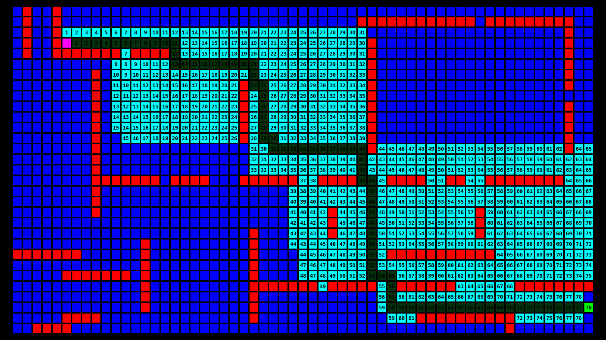

# A* algorithm visualization (pygame)

Simple script to visualize A* algorithm with manhattan heuristics.

Usage:
```
./main.py map_file
```
`map_file` is a simple text file specifying grid structure, where:

`1` - wall

`0` - free space

`s` - start

`t` target

Example:
```
111111111111111111111111111111
100000000000000000000000000001
10s000000000000000000000000001
100000000000000000000000000001
100000000000000000000000000001
100000000000000000000000000001
100000000000000000001111111101
100000000000000000001000000001
100000000000000000001000000001
10000000000000000000100000t001
100000000000000000001000000001
100000000000000000001000000001
100000000000000000000000000001
111111111111111111111111111111
```

Number on each tile specify length of shortest (based on heuristics) path from start

test_file1:


test_file2:

